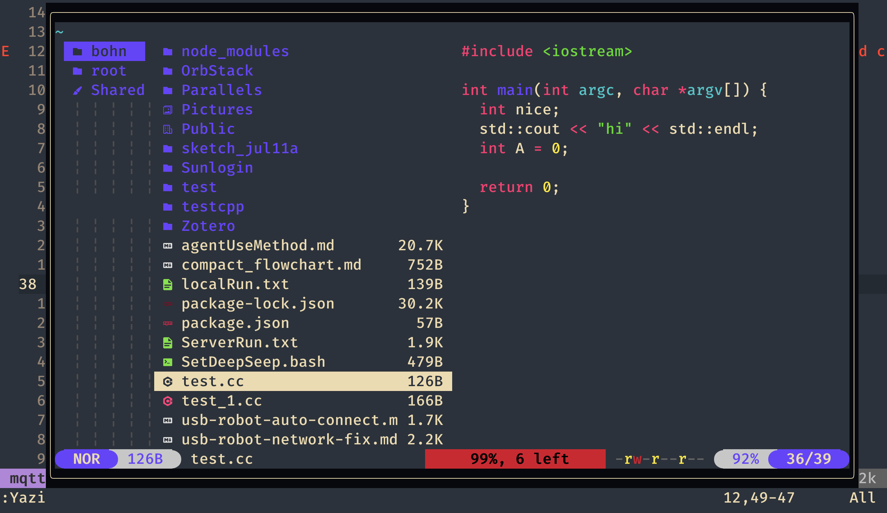
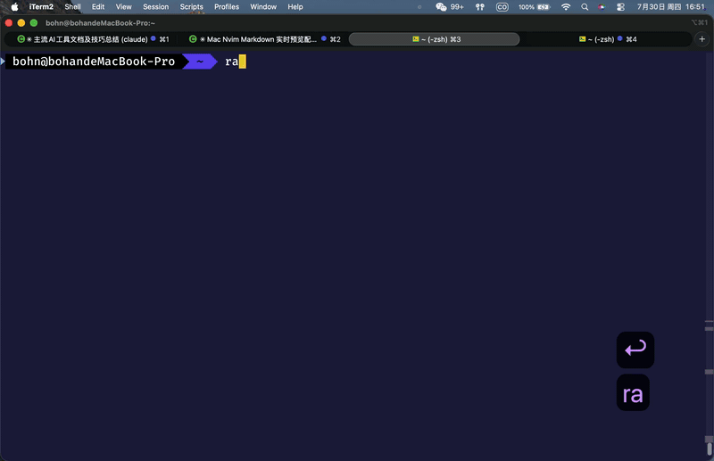
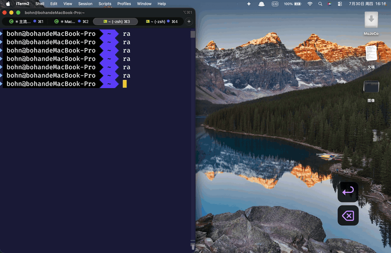
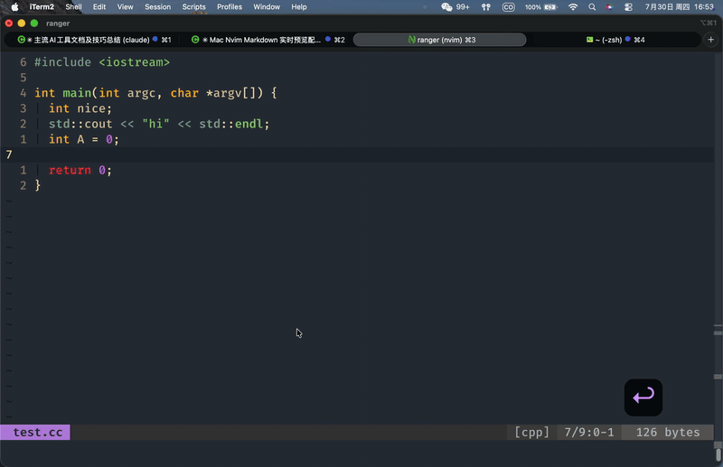

<!-- SHIELDS / BADGES -->
<p align="center">
  <a href="https://github.com/BohnChen/nvim"></a>
  <a href="https://github.com/BohnChen/nvim"></a>
  <a href="https://github.com/BohnChen/nvim/blob/main/LICENSE"></a>
</p>

<br />

<!-- TITLE -->
<div align="center">
  <h1>Colemak Neovim Lite</h1>
  <p>面向 Apple Silicon Mac 的轻量 Neovim 配置。<br />
  保留 Colemak 键位 · Lazy.nvim 管理 · 原生 LSP · 开箱即写</p>
</div>

<br />

<p align="center">
  
</p>

<br />

## 为什么这份配置

从复杂臃肿的 coc.nvim 配置中剥离，保留 Colemak 手感、代码补全、常用编辑增强，移除容易在插件更新后报错的链路。**稳定 > 丰富**。

<br />

## 快速开始

```sh
# 1. 备份旧配置
mv ~/.config/nvim ~/.config/nvim.bak

# 2. 放入新配置
cp -r . ~/.config/nvim

# 3. 启动（lazy.nvim 自动安装所有插件）
nvim

# 4. 重启后安装核心语言服务器
nvim +LiteLspInstallCore
```

首次启动时还会自动安装 `fd`（FZF 文件搜索加速器，需 Homebrew）。

<br />

## 特性一览

| 特性 | 说明 |
|------|------|
| **Colemak 原生键位** | `u/e/n/i` 方向移动，无需切换键位 |
| **即搜即得** | `<C-p>` FZF + fd 项目文件搜索；`<Leader>fh` 全屋搜索 |
| **实时预览** | `F7` Markdown 预览；`ts` 单词翻译 |
| **代码片段** | `<Leader>sn` 按文件类型创建；保存即生效 |
| **智能补全** | nvim-cmp + LuaSnip，`<C-e>/<C-p>` 占位符跳转 |
| **文件管理器** | `<Leader>y` Yazi 浮动窗口，ranger 风格 |
| **原生 LSP** | 内置 18 种语言服务器配置，用完才加载 |
| **一键注释** | `Ctrl+/` 注释/取消注释当前行或选区 |
| **零焦虑升级** | `:Lazy` 管理所有插件，版本锁定 |

<br />

## 使用栈

### 编辑器
- **[Neovim](https://neovim.io/) 0.11+** — 核心编辑器
- **[lazy.nvim](https://github.com/folke/lazy.nvim)** — 插件管理（自动懒加载）
- **[nvim-cmp](https://github.com/hrsh7th/nvim-cmp)** — 补全引擎
- **[LuaSnip](https://github.com/L3MON4D3/LuaSnip)** — 代码片段引擎（自定义片段自动重载）

### 语言服务
- **[Mason](https://github.com/mason-org/mason.nvim)** — LSP 安装器
- Neovim 原生 LSP 框架 — 零外部框架依赖
- 内置：Lua、Python、TypeScript、Go、C/C++、Rust、Dart、Swift、Java、C#、Terraform 等

### 工具链
- **[fd](https://github.com/sharkdp/fd)** — 文件搜索（比 find 快 10×）
- **[fzf](https://github.com/junegunn/fzf)** — 模糊搜索
- **[Yazi](https://yazi-rs.github.io/)** — 终端文件管理器
- **[Marksman](https://github.com/artempyanykh/marksman)** — Markdown LSP

<br />

<p align="center">
  
</p>

## 补全与片段

### 快捷键

| 按键 | 功能 |
|------|------|
| `<Tab>` | 触发补全 / 菜单向下选择 |
| `<C-n>` | 补全菜单向下选择 |
| `<C-p>` | 补全菜单向上选择 / 无菜单时跳转上一个占位符 |
| `<C-e>` | 展开片段 / 跳转到下一个占位符 |
| `<CR>` | 确认补全 |

### 使用流程

```
输入 mai → <Tab> 触发 → 选中 main → <CR> 确认
        → 片段展开 → <C-e> 跳占位符 → 输入覆盖默认值
        → <C-p> 跳回上一个占位符
```

### 自定义片段

```vim
<Leader>sn   " 按当前文件类型自动打开对应的 .snippets 文件
```

保存文件后**立即生效**，无需重启。支持 SnipMate / VSCode / Lua 三种格式。

内置片段文件：
- `cpp.snippets` — 20 个（main/cout/fori/class/Test/…）
- `python.snippets` — 14 个（def/class/async/try/…）
- `java.snippets` — 19 个（class/method/override/…）
- `typescript.snippets` — 21 个（interface/type/async/…）
- `javascript.snippets` — 13 个（af/forof/import/…）
- `sh.snippets` — 19 个（case/getopt/trap/…）

<br />

## 常用快捷键

### Colemak 基础

| 按键 | 功能 |
|------|------|
| `u/e/n/i` | 上 / 下 / 左 / 右 |
| `U/E/N/I` | 上移5行 / 下移5行 / 行首 / 行尾 |
| `k` = 插入 | `K` = 行首插入 |
| `l` = 撤销 | `Y` = 复制到剪贴板 |
| `;` = 命令行 | `Q` = 退出 |
| `S` = 保存 | `<Leader>rc` = 编辑配置 |

### 文件与搜索

| 按键 | 功能 |
|------|------|
| `<C-p>` | 搜索当前项目文件（受 pwd 限制） |
| `<Leader>fh` | 搜索整个家目录 |
| `<C-f>` | 全文件内容搜索（ripgrep） |
| `<Leader>y` | 打开 Yazi 文件管理器 |

### Markdown 与写作

| 按键 | 功能 |
|------|------|
| `F7` / `F8` | 打开 / 关闭浏览器预览 |
| `<Leader>sc` | 开关拼写检查 |
| `<Leader>tm` | Table 模式开关 |

<p align="center">
  
</p>

### 开发辅助

| 按键 | 功能 |
|------|------|
| `ts` | 翻译光标下单词 |
| `L` | 打开撤销树 |
| `Ctrl+/` | 注释/取消注释 |
| `gd` | 跳转到定义 |
| `gr` | 查找引用 |
| `<Leader>h` | 查看文档（Hover） |
| `<Leader>rn` | 重命名 |
| `<Leader>a` | Code action |
| `<Leader>lf` | 格式化 |

### 窗口与 Tab

| 按键 | 功能 |
|------|------|
| `su/e/n/i` | 上/下/左/右 分屏 |
| `<Leader>w` | 切换窗口 |
| `tu` / `td` | 新建 tab / 关闭 tab |
| `tn` / `ti` | 上一个 / 下一个 tab |

<br />

## Yazi 文件管理器

<p align="center">
  
</p>

| 按键 | 功能 |
|------|------|
| `u` / `e` | 上 / 下移动 |
| `n` | 返回上级目录 |
| `i` | 进入目录或文件 |
| `<Space>` | 多选文件 |
| `dd` / `yy` / `pp` | 剪切 / 复制 / 粘贴 |
| `f` | 过滤 |
| `/` | 搜索 |
| `<C-p>` | fzf 跳转 |
| `q` | 关闭 |

需要先安装：
```sh
brew install yazi
```

<br />

## LSP 支持

| 语言                    | LSP                 | 安装方式         |
|-------------------------|---------------------|------------------|
| Lua                     | lua-language-server | Mason / Homebrew |
| Python                  | pyright             | Mason / npm      |
| TypeScript / JavaScript | ts_ls               | Mason / npm      |
| Go                      | gopls               | Mason / Go       |
| C/C++                   | clangd              | Mason / Homebrew |
| Rust                    | rust-analyzer       | Rustup           |
| Java                    | jdtls               | Mason            |
| C#                      | omnisharp           | Homebrew         |
| 更多…                   | 见 init.vim         |                  |

```vim
:LspEnabled   " 检查启用的 LSP
:LspMissing   " 检查缺失的 LSP
:LspInfo      " 当前 buffer 的 LSP
```

<br />

## 本地覆盖

创建 `~/.config/nvim/local.vim` 启用可选功能：

```vim
let g:lite_enable_copilot = 1        " GitHub Copilot
let g:lite_enable_treesitter = 1     " Treesitter 高亮
let g:lite_enable_lua_extras = 1     " gitsigns, colorizer, spectre
let g:lite_enable_file_managers = 1  " lazygit, rnvimr
```

<br />

## 常见问题

**Q: 打开 Markdown 文件后没有自动预览？**
```sh
cd ~/.local/share/nvim/lazy/markdown-preview.nvim/app && bash install.sh
```

**Q: LSP 不工作？**
```vim
:LspMissing         " 看哪些没装
:checkhealth        " 健康检查
```

**Q: Yazi 打不开？**
```sh
brew install yazi
```

**Q: FZF 搜索比较慢？**
配置会在启动时自动安装 `fd`。也可以手动：
```sh
brew install fd
```

<br />

## 设计理念

- **稳定优先** — 不默认启用 Copilot、Treesitter 等可能受外部环境影响的功能
- **键盘流** — 所有操作不离键盘，Colemak 键位贯穿始终
- **轻量可排错** — 配置结构清晰，问题能快速定位
- **新机器友好** — git clone → nvim → 走人，自动装依赖无手工步骤

<br />

## 致谢

特别感谢 **[theniceboy](https://github.com/theniceboy)** — 这份配置中的大部分插件选择、键位设计和编辑增强细节，都来自在他的项目中学习到的经验。他的代码让我对 Vim 配置的灵活性有了更深入的理解。

<br />

## 许可证

MIT License. See `LICENSE` for more information.

<br />

---

<p align="center">
  由 init.vim + lazy.nvim + ❤️ 驱动
</p>
